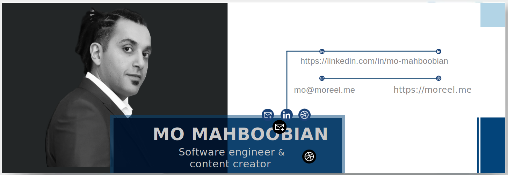

<!-- Intro  -->

  <h1>
    <samp>&gt; Hey there! 😊</samp>
  </h1>
  
<h3 align="center"><a href="https://moreel.me">「  I am a Creative Full-Stack Engineer 」</a></h3>

 
   With a Passion for Problem Solving

     
    
  

  

  

<!-- About Section -->

# 👨🏻‍💻&emsp;About me

 ✌️ &emsp; Enjoy creating content and sharing knowledge  
 ❤️ &emsp; Love to writing code and learning new features  

I a Full-Stack JavaScript Software engineer specialising in React.Js and Next.Js. I build bullet proof online user experiences using TypeScript and Test Driven Development.
At heart I’m a technical problem solver with a creatives eye. This passion for technology inspired me to dive deep into web development through intensive bootcamps, where I honed my craft and learnt modern frameworks and tools. As a life-long learner, to me, the ever evolving nature of the web is an rewarding place to work.
I worked in both creative content and technical. This experience expanded my expertise beyond coding to encompass; system design, product-focused development, strategic planning, user experience design and agile project delivery.

###

  

## 💻&emsp;Use to Code

## ☁️&emsp;Use to Host

## 🎨&emsp;Use to Design

## 📚&emsp;Learning

 
